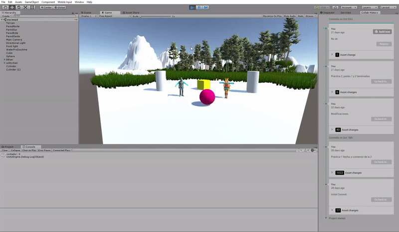

# Introducción a los scripts en Unity

Sobre la escena que has trabajado programa los scripts necesarios para las siguientes acciones:
- Cada vez que Ethan colisione con una esfera se debe incrementar un contador: `CollisionCounter.cs`
- Una de las esferas estará fija, la otra debe estar rodando aleatoriamente por la escena (`RandomMovement.cs`). La esfera que rueda debe responder a las física.
- Se deben incluir cilindros que actúen como sensores, de forma que cambian de color cuando Ethan o la esfera estén cerca. Se deben elegir tres tonos de intensidad que se asignarán según el estado de la colisión para cada uno de ellos. Por ejemplo, Ethan 3 tonos de rojo según entre en colisión, siga en colisión o salga de la colisión: `CollisionSensor.cs`
- Ubicar un tercer objeto que sea capaz de detectar colisiones y que se mueva con las teclas: I, L, J, M.

Autor: Sara Revilla Báez